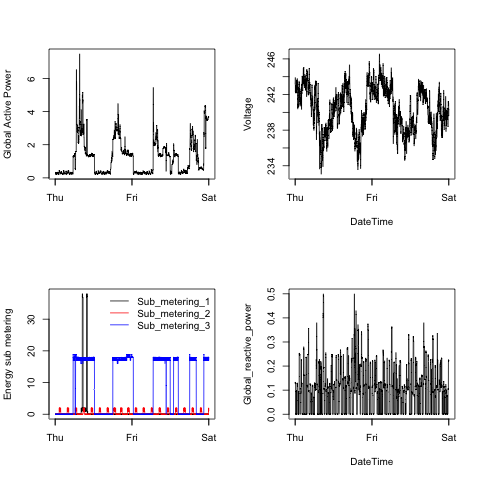

Exploratory Data Analysis
=========================

Course Project 1
----------------

Here you will find the scripts and the images that they produce for the exploration of the
"Individual household electric power consumption Data Set", that contains the measurements
of electric power consumption in one household with a one-minute sampling rate over a
period of almost 4 years. Different electrical quantities and some sub-metering values are
available. 

These are exploratory graphs, quickly made and only useful for analysis, not for
publishing.

The README for this assignment is in [README_ORIG.md](README_ORIG.md).

### Data acquisition

The data is loaded from `https://d396qusza40orc.cloudfront.net/exdata%2Fdata%2Fhousehold_power_consumption.zip`.

The loading function is in the R script [`readdata.R`](readdata.R) that all other scripts
use.

To read the data, you must:

1. call `get.file()` and store the return, that is the filename created with the data;
2. call `read.data(filename)`, that will return the data from 2007-01-01 and 2007-01-02.
   `filename` is the return from `get.file()`.

### The graphs

The graphs are created by the scripts `plot1.R`, `plot2.R`, `plot3.R` and `plot4.R`.

Below are the graphs that they create.

#### Plot 1

Script: [`plot1.R`](plot1.R)

Global Active Power frequency.

Reference graph: [plot of chunk unnamed-chunk-2](figure/unnamed-chunk-2.png) 

#### Plot 2

Script: [`plot2.R`](plot2.R)

Global Active Power by date.

Reference graph: [plot of chunk unnamed-chunk-3](figure/unnamed-chunk-3.png)

#### Plot 3

Script: [`plot3.R`](plot3.R)

Energy sub metering by date.

Reference graph: [plot of chunk unnamed-chunk-4](figure/unnamed-chunk-4.png)

#### Plot 4

Script: [`plot4.R`](plot4.R)

4 graphs by date: Global Active Power, Voltage, Energy sub metering and Global reactive
power.

Reference graph: [plot of chunk unnamed-chunk-5](figure/unnamed-chunk-5.png)

